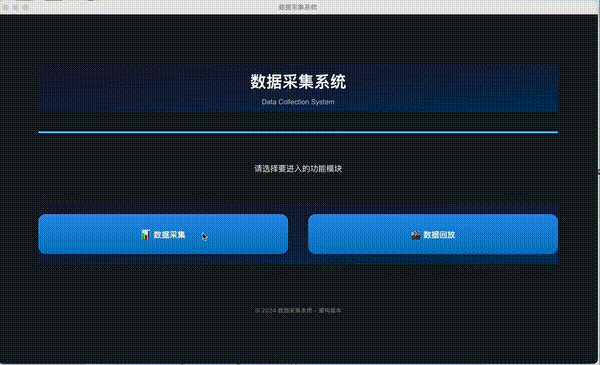
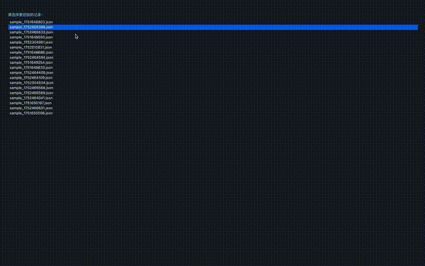

# examRecorder 数据采集与回放系统

## 项目简介

examRecorder 是一套用于考试/问卷/行为数据采集与回放的桌面端系统，支持屏幕录制、摄像头录制、键盘输入采集与同步回放。界面美观，交互流畅，适合科研、教育、行为分析等场景。

## 主要功能

- **数据采集**：
  - 屏幕录制、摄像头录制同步采集
  - 键盘输入实时记录
  - 题目展示与用户输入采集
  - 采集数据自动保存为JSON和视频文件

- **数据回放**：
  - 支持选择历史采集记录回放
  - 屏幕与摄像头视频同步播放
  - 时间轴缩略图、进度拖动、跳转、倍速播放
  - 联动/独立回放模式切换
  - 详细信息面板与虚拟键盘高亮

## 安装与运行

1. **环境准备**
   - Python 3.8+
   - 推荐使用虚拟环境
   - 依赖 ffmpeg（用于视频转GIF，可选）

2. **依赖安装**
   ```bash
   pip install -r requirements.txt
   ```

3. **运行程序**
   ```bash
   python main.py
   ```

## 界面演示

- **数据采集 Demo**

  

- **数据回放 Demo**

  

> 如需生成 GIF，可用 ffmpeg 脚本将 mp4 转为 gif，详见下方说明。

## 目录结构

```
examRecorder/
├── gui/                  # 主程序代码
├── docs/                 # 文档与演示动图
│   ├── demo_collect.gif
│   └── demo_replay.gif
├── requirements.txt      # 依赖列表
├── README.md             # 项目说明
└── ...
```

## 视频转GIF脚本

如需将 mp4 演示视频转为 gif，可使用如下 Python 脚本（需先安装 ffmpeg）：

```python
import subprocess

def mp4_to_gif(mp4_path, gif_path, fps=10, scale=600):
    cmd = [
        'ffmpeg',
        '-i', mp4_path,
        '-vf', f'fps={fps},scale={scale}:-1:flags=lanczos',
        '-y',
        gif_path
    ]
    subprocess.run(cmd, check=True)

# 示例用法
mp4_to_gif('docs/demo_collect.mp4', 'docs/demo_collect.gif')
mp4_to_gif('docs/demo_replay.mp4', 'docs/demo_replay.gif')
```

## 联系方式

- 作者：ST Xu
- 邮箱：xvshiting@live.com
- Issues/PR 欢迎提交！ 